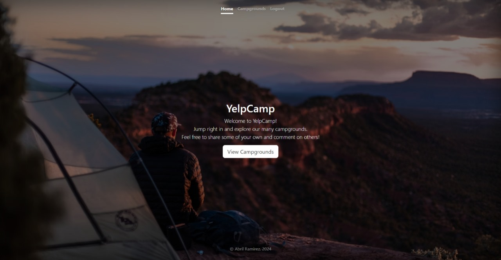

# YelpCamp 🏕️
## Developed project during the "The Web Developer Bootcamp 2024" course of Udemy.

### -> Description
This project it's a "clone" of the "Yelp" social media. The diference to this project is that it's themed for Campgrounds, where the users can make an account, login, and review existing campgrounds of other users or register their own camps.

### -> Technologies
          

### -> Website

  <a href="https://yelpcamp-xup4.onrender.com/"><strong>➥ Live Demo</strong></a>

 

  
### -> Developer
#### **Name**: _Ramirez Flores Abril._
#### **Checkout my other projects** :octocat: [iscRamirezAbril](https://github.com/iscRamirezAbril)
#### **Profession**: UI/UX Designer
